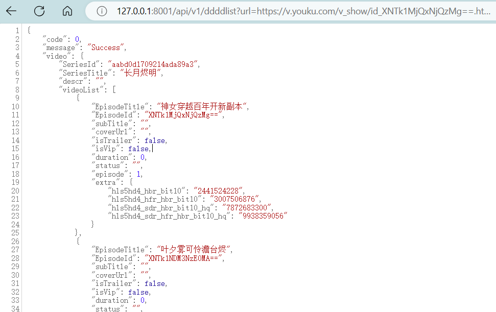

# ddddhmlist

获取流媒体视频列表信息

[](https://github.com/Tontonnow/ddddhmlist)    [](https://github.com/Tontonnow/ddddhmlist)    [](https://github.com/Tontonnow/ddddhmlist/releases)   [](https://github.com/Tontonnow/ddddhmlist) [](https://github.com/Tontonnow/ddddhmlist/releases)    [](https://github.com/Tontonnow/ddddhmlist/graphs/contributors)

<!-- TOC -->
* [ddddhmlist](#ddddhmlist)
  * [介绍](#介绍)
  * [文件目录说明](#文件目录说明)
  * [使用方法](#使用方法)
    * [配置文件说明](#配置文件说明)
  * [API](#api)
    * [获取视频列表](#获取视频列表)
  * [如何参与贡献](#如何参与贡献)
    * [注意事项](#注意事项)
  * [已知问题](#已知问题)
  * [更新日志](#更新日志)
    * [2024-04-06](#2024-04-06)
  * [更新计划](#更新计划)
  * [提问交流](#提问交流)
<!-- TOC -->


## 介绍

本项目是一个获取流媒体视频列表信息的工具。

主要支持中国各大流媒体平台点播视频的获取,个人上传的视频不支持(不测试,实际自行测试)。

接口主要使用app和TV端的接口,绝大部分不需要额外参数,不保证长期有效,如有问题请提交issue或者pr。

目前支持以下网站:

| site                               | url                         | Status                                                                                                                                                                 |
|------------------------------------|-----------------------------|------------------------------------------------------------------------------------------------------------------------------------------------------------------------|
| [Bilibili](website%2FBilibili)     | https://www.bilibili.com    |      |
| [Friday](website%2FFriday)         | https://video.friday.tw     |          |
| [Hami](website%2FHami)             | https://hamivideo.hinet.net |              |
| [iqy](website%2FIQ%2Fiqy.go)       | https://www.iqiyi.com       |                  |
| [iq](website%2FIQ%2Fiq.go)         | https://www.iq.com          |                  |
| [KKTV](website%2FKKTV)             | https://kktv.me             |              |
| [LETV](website%2FLETV)             | https://www.le.com          |              |
| [Litv](website%2FLitv)             | https://www.litv.tv         |              |
| [MGTV](website%2FMGTV)             | https://www.mgtv.com        |              |
| [MIGU](website%2FMIGU)             | https://m.miguvideo.com     |              |
| [MytvSuper](website%2FMytvSuper)   | https://www.mytvsuper.com   |    |
| [MyVideo](website%2FMyVideo)       | https://www.myvideo.net.tw  |        |
| [TXTV](website%2FQQTV%2FTXTV.go)   | https://v.qq.com            |              |
| [WETV](website%2FQQTV%2FWETV.go)   | https://wetv.vip            |              |
| [VIKI](website%2FVIKI)             | https://www.viki.com        |              |
| [VIU](website%2FVIU)               | https://www.viu.com         |                |
| [XiGUA](website%2FXiGUA)           | https://www.ixigua.com      |            |
| [yangshipin](website%2Fyangshipin) | https://www.yangshipin.cn   |  |
| [YOUKUTV](website%2FYOUKUTV)       | https://v.youku.com         |        |
| [YOUKUTV](website%2FYOUKUTV)       | https://www.youku.tv        |        |
|                                    |                             |                                                                                                                                                                        |

## 文件目录说明

```

│  config.yaml
│  trpc_go.yaml //这两个配置文件必须有,注意要和软件运行目录放一起
│  go.mod
│  go.sum
│  LICENSE.txt
│  README.md
├─.github
│  └─workflows //在线自动test或者编译，建议fork后自行运行或修改，在线测试不一定准确                   
├─cmd
│  ├─client
│  │      a.http
│  │      a.sh
│  │      client.go
│  │      
│  └─server
│          a.sh   //win 下交叉编译命令 shell
│          app.go
│          
├─config
│      config.go
│      
├─img
│      img.png
│      
├─server
│  │  data.go
│  │  ddddlist.pb.go
│  │  
│  ├─proto
│  │      ddddlist.proto    //proto文件 很重要 
│  │      ddddlist.sh       //编译trpc代码命令行
│  │      
│  └─trpc
│          ddddlist.trpc.go
│          server.go
│          
├─tmp
│  └─log            //运行日志存放目录
├─utils
│  │  tool.go
│  │  
│  ├─jwt
│  │      jwt.go
│  │      jwt_test.go
│  │      
│  └─sesssion
│          session.go
│          
└─website
    │  web.go
    │  
    ├─Bilibili
    │      b.go                 //主体，建议自行修改，增加字段优化代码
    │      b_test.go            //test文件 修改代码后建议先test
    │      
    ├─Friday
    │      Friday.go
    │      Friday_test.go
    │      
    ├─Hami
    │      hami.go
    │      hami_test.go
    │      
    ├─IQ
    │      iq.go
    │      iqy.go
    │      iqy_test.go
    │      iq_test.go
    │      
    ├─KKTV
    │      kktv.go
    │      kktv_test.go
    │      
    ├─LETV
    │      letv.go
    │      letv_test.go
    │      
    ├─Litv
    │      litv.go
    │      litv_test.go
    │      
    ├─MGTV
    │      mgtv.go
    │      mgtv_test.go
    │      
    ├─MIGU
    │      mg.go
    │      mg_test.go
    │      
    ├─MytvSuper
    │      mytvsuper.go
    │      mytvsuper_test.go
    │      
    ├─MyVideo
    │      myvideo.go
    │      myvideo_test.go
    │      
    ├─QQTV
    │  │  basic_data.pb.go
    │  │  env.pb.go
    │  │  feed_data.pb.go
    │  │  request_base.pb.go
    │  │  trpc_video_detail_list.pb.go
    │  │  TXTV.go
    │  │  TXTV_test.go
    │  │  WETV.go
    │  │  wetv.pb.go
    │  │  
    │  └─proto                          //WETV 的trpc pb文件，自己实现了trpc组包，建议阅读trpc文档,自行重新优化
    │          basic_data.proto
    │          env.proto
    │          feed_data.proto
    │          request_base.proto
    │          trpc_video_detail_list.proto
    │          wetv.proto
    │          
    ├─VIKI
    │      viki.go
    │      viki_test.go
    │      
    ├─VIU
    │      viu.go
    │      viu_test.go
    │      
    ├─XiGUA
    │      xg.go
    │      xg_test.go
    │      
    ├─yangshipin
    │  │  yangshipin.pb.go
    │  │  ysp.go
    │  │  ysp_test.go
    │  │  
    │  ├─proto
    │  │      yangshipin.proto        //web 端
    │  │      
    │  └─tars                         //app 端 协议暂未开源 建议自行研究 tx jce(tars)
    │          ONATVDetailsVideoSquareListItem.tars
    │          RequestCommand.tars
    │          ResponseCommand.tars
    │          VideoDetailsRequest.tars
    │          VideoDetailsResponse.tars
    │          
    └─YOUKUTV
            yk.go
            yk_test.go
            
```

## 使用方法

安装go,并设置好环境变量,然后执行以下命令

```
git clone https://github.com/Tontonnow/ddddhmlist.git

修改config.yaml(可选,主要是部分网站需要代理)

cd ddddhmlist
go run ./cmd/server
```

然后访问http://127.0.0.1:8001/api/v1/ddddlist?url=https://v.youku.com/v_show/id_XNTk1MjQxNjQzMg==.html


### 配置文件说明

[config.yaml](config.yaml) 程序配置文件 目前就一个proxy字段有用,其他的暂时没写

[tree.txt](tree.txt) trpc的配置文件,自行参考trpc[文档](https://github.com/trpc-group/trpc-go/blob/main/README.zh_CN.md)


## API
### 获取视频列表

> ip:port/api/v1/ddddlist?url=xxx

*请求方式：GET POST TRPC * 具体参考[client](cmd%2Fclient)


**json回复：**

根对象：

| 字段      | 类型  | 内容   | 备注                                                      |
|---------|-----|------|---------------------------------------------------------|
| code    | num | 返回值  | 0:成功  <br/>1:内部错误<br/>2：url不支持支持的url<br/>请参考test文件里面的地址 |
| message | str | 返回信息 | 错误信息中包含id,请根据id排除，以及日志文件排除                              |
| data    | obj | 信息本体 | 具体看proto文件<br/>目前只返回了必要的信息                              |

## 如何参与贡献

1. [fork 本项目](https://github.com/Tontonnow/ddddhmlist/fork)
2. 创建 你的特性分支 (`git checkout -b feature/xxxx`)
3. 提交 你的改动 (`git commit -am 'Add some xxx'`)
4. 推送 到分支 (`git push origin feature/xxxx`)
5. 提交一个 Pull Request
6. 等待作者合并
7. 欢迎star
8. 欢迎提交issue
9. 欢迎提交pr

### 注意事项
1. 请不要提交无意义的pr
2. 提交pr请先test
3. 新增api建议使用trpc 或者grpc 可以同时支持http和rpc
4. 新增的网站请在readme里面更新
5. 不接受解析网页,只接受api解析,建议使用TV、app端或者更新很少的接口
6. 建议协议格式为json,xml,protobuf等,尽量不需要登录

## 已知问题

1. 有些网站需要代理,请自行修改config.yaml 如hami viu 
2. 优酷的mtop接口建议在国内使用,国外可能会有问题
3. iq和hami的使用TV端接口,token可能会失效(7天或更长)

## 更新日志

### 2024-04-06

1. 初版发布

## 更新计划

1. 增加语言地区选择
2. 增加国外网站(nflx,disney等)


## 提问交流

* [提交issue](https://github.com/Tontonnow/ddddhmlist/issues/new)
* 提问前请先阅读[提问的智慧](https://lug.ustc.edu.cn/wiki/doc/smart-questions/),无效问题会被忽略

## License

[MIT](LICENSE.txt) © [Tontonnow](https://github.com/Tontonnow/ddddhmlist/blob/master/LICENSE.txt)
